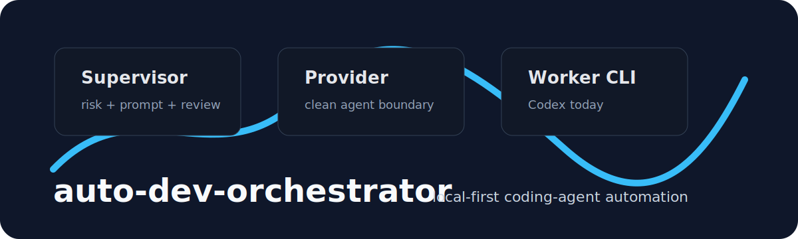
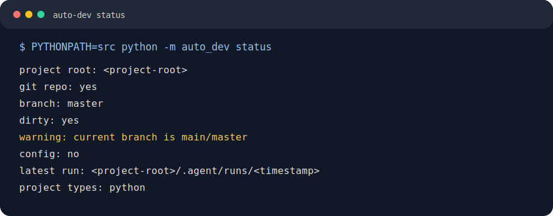
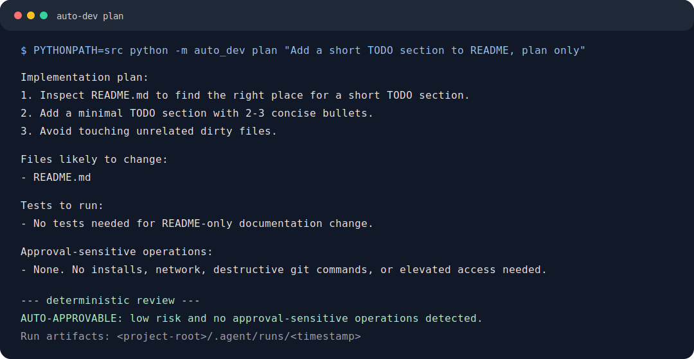
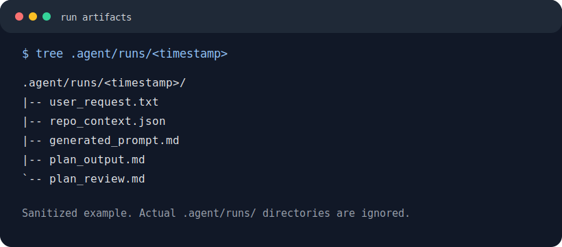
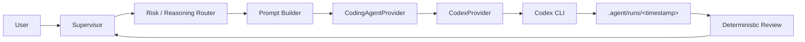

# auto-dev-orchestrator



Local-first supervisor-worker orchestration for coding agents.

`auto-dev` turns a manual "supervisor reviews worker output" coding workflow into a small, safety-first CLI. It uses a provider-agnostic supervisor layer, with Codex CLI as the first worker provider and room for Claude Code, Gemini CLI, or other agents later.

[](pyproject.toml)
[](https://github.com/egeyasar0/auto-dev-orchestrator/actions/workflows/tests.yml)
[](LICENSE)
[](pyproject.toml)

## Screenshots



[View status screenshot](docs/assets/screenshots/status.svg)



[View plan screenshot](docs/assets/screenshots/plan.svg)



[View run artifacts screenshot](docs/assets/screenshots/artifacts.svg)

Screenshots are generated from sanitized local CLI output. They do not include private paths, tokens, or run artifacts.

## What It Does

`auto-dev` coordinates a local coding-agent loop:

- Understand the task and inspect repository context.
- Classify risk and select reasoning effort.
- Build an optimized worker prompt.
- Run a provider such as Codex CLI in the right sandbox mode.
- Save run artifacts under `.agent/runs/<timestamp>/`.
- Review plans and implementation output with deterministic safety gates.

The current MVP is intentionally small: Python standard library only, one provider implementation, no daemon, no web UI, no plugin loader.

## Architecture

The supervisor owns orchestration. The worker provider owns provider-specific command construction.



See [docs/architecture.md](docs/architecture.md) for more detail.

## Safety Model

- Plan and review use Codex read-only sandbox mode.
- Implementation uses workspace-write sandbox mode.
- `--yolo` and `danger-full-access` are not used.
- Dirty working trees block implementation unless changes are only under `.agent/`.
- Risky plans require user approval.
- Provider-specific logic stays inside provider classes.
- `.agent/runs/` is ignored because prompts and outputs may contain sensitive project context.

## Installation

From a local checkout:

```powershell
python -m pip install -e .
```

For development without installation:

```powershell
$env:PYTHONPATH='src'; python -m auto_dev status
```

## Commands

```powershell
auto-dev status
auto-dev plan "your task"
auto-dev run "your task"
auto-dev review
```

Development equivalent:

```powershell
$env:PYTHONPATH='src'; python -m auto_dev status
$env:PYTHONPATH='src'; python -m auto_dev plan "your task"
$env:PYTHONPATH='src'; python -m auto_dev review
```

## Example Workflow

```powershell
$env:PYTHONPATH='src'; python -m auto_dev status
$env:PYTHONPATH='src'; python -m auto_dev plan "Add a small README improvement"
```

For implementation, start from a clean Git working tree:

```powershell
$env:PYTHONPATH='src'; python -m auto_dev run "Add a small README improvement"
```

## Project Structure

```text
src/auto_dev/
  cli.py                 CLI entry point
  config.py              .agent/config.toml loading with safe defaults
  risk.py                rule-based risk classification
  reasoning.py           rule-based reasoning effort routing
  prompt_builder.py      worker prompt construction
  plan_review.py         deterministic plan review
  providers/             provider interface and CodexProvider
  repo/                  Git and project detection helpers
  runtime/               command runner and run store
tests/                   unittest suite
docs/                    GitHub docs and sanitized SVG assets
examples/                safe example configuration
```

## Configuration

Configuration is optional. Missing `.agent/config.toml` uses safe defaults.

Start from [examples/config.example.toml](examples/config.example.toml). Do not commit real local config.

## Development

Run tests:

```powershell
$env:PYTHONPATH='src'; python -m unittest discover -s tests -v
```

Check status:

```powershell
$env:PYTHONPATH='src'; python -m auto_dev status
```

## What Not To Commit

Do not commit:

- `.agent/runs/`
- `.agent/config.toml`
- `.env` or `.env.*`
- API keys, credentials, tokens, or secrets
- virtual environments, caches, logs, build output
- raw local terminal output containing private paths or usernames

## Provider Roadmap

- Codex CLI: implemented.
- Claude Code: planned provider.
- Gemini CLI: planned provider.
- Other coding agents: possible through the provider interface.

## Security

This tool runs local coding agents and commands. Review generated plans, diffs, and run artifacts before accepting changes. See [SECURITY.md](SECURITY.md).

## Roadmap

- Expand safe review/fix loops.
- Add richer test command detection.
- Add more worker providers behind the same interface.
- Improve structured artifact summaries.

## License

MIT. See [LICENSE](LICENSE).

---

# auto-dev-orchestrator Türkçe

Kodlama ajanları için yerel öncelikli supervisor-worker orkestrasyonu.

`auto-dev`, manuel "supervisor inceler, worker uygular" akışını küçük ve güvenlik odaklı bir CLI aracına dönüştürür. İlk worker sağlayıcısı Codex CLI'dır; mimari daha sonra Claude Code, Gemini CLI veya başka ajanları eklemeye uygundur.

## Ekran Görüntüleri


[Durum ekran görüntüsünü aç](docs/assets/screenshots/status.svg)


[Plan ekran görüntüsünü aç](docs/assets/screenshots/plan.svg)


[Çalışma artefaktları ekran görüntüsünü aç](docs/assets/screenshots/artifacts.svg)

Ekran görüntüleri temizlenmiş yerel CLI çıktılarından üretilmiştir. Özel path, token veya çalışma artefaktı içermez.

## Ne Yapar?

- İsteği ve depo bağlamını anlar.
- Risk seviyesini ve reasoning effort değerini seçer.
- Worker ajan için optimize edilmiş prompt üretir.
- Codex CLI gibi sağlayıcıları doğru sandbox modunda çalıştırır.
- Çalışma artefaktlarını `.agent/runs/<timestamp>/` altında saklar.
- Planları ve çıktıları deterministik güvenlik kontrollerinden geçirir.

## Güvenlik Modeli

- Plan ve review adımları read-only sandbox kullanır.
- Uygulama adımı workspace-write sandbox kullanır.
- `--yolo` ve `danger-full-access` kullanılmaz.
- Temiz olmayan Git çalışma ağacı uygulamayı engeller; `.agent/` altındaki artefaktlar hariçtir.
- Riskli planlar kullanıcı onayı ister.
- Provider'a özel mantık provider sınıflarında kalır.

## Kurulum

```powershell
python -m pip install -e .
```

Kurulum yapmadan geliştirme modunda:

```powershell
$env:PYTHONPATH='src'; python -m auto_dev status
```

## Komutlar

```powershell
auto-dev status
auto-dev plan "görev"
auto-dev run "görev"
auto-dev review
```

## Geliştirme

```powershell
$env:PYTHONPATH='src'; python -m unittest discover -s tests -v
```

## Commit Edilmemesi Gerekenler

- `.agent/runs/`
- `.agent/config.toml`
- `.env` veya `.env.*`
- API anahtarları, kimlik bilgileri, token'lar veya secret değerler
- sanal ortamlar, cache dosyaları, loglar, build çıktıları
- özel path veya kullanıcı adı içeren ham yerel çıktı

## Lisans

MIT. Ayrıntılar için [LICENSE](LICENSE).
