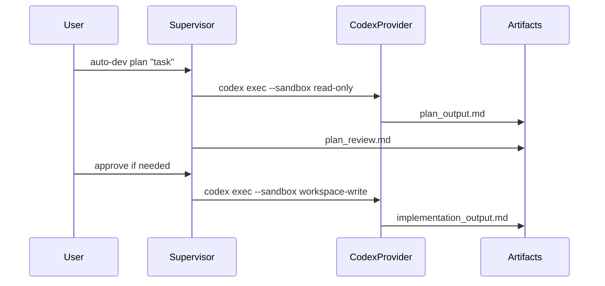

# Architecture

`auto-dev-orchestrator` keeps orchestration separate from worker-provider details.

```mermaid
flowchart LR
  User["User"] --> Supervisor["Supervisor"]
  Supervisor --> Inspector["Repository Inspector"]
  Inspector --> Router["Risk / Reasoning Router"]
  Router --> Prompt["Prompt Builder"]
  Prompt --> Interface["CodingAgentProvider"]
  Interface --> CodexProvider["CodexProvider"]
  CodexProvider --> CodexCLI["Codex CLI"]
  CodexCLI --> Artifacts[".agent/runs/{timestamp}"]
  Artifacts --> Tests["Tests"]
  Tests --> Review["Deterministic Review"]
  Review --> Supervisor
```

## Components

- `Supervisor`: coordinates the workflow.
- `PromptBuilder`: turns the user request and repo context into worker prompts.
- `RiskClassifier`: classifies the task as low, medium, high, or xhigh.
- `ReasoningRouter`: selects reasoning effort from risk and config.
- `CodingAgentProvider`: provider interface for worker agents.
- `CodexProvider`: current Codex CLI implementation.
- `RunStore`: stores prompts, outputs, diffs, and summaries under `.agent/runs/<timestamp>/`.
- `GitGuard`: keeps implementation steps on a clean working tree.

## Safety Flow

